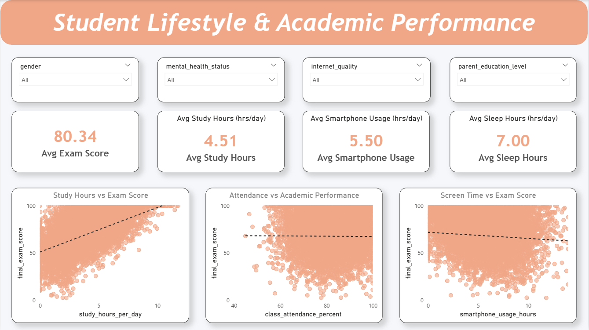

# 🎓 Student Lifestyle & Academic Performance Analysis

> **End-to-end Data Science project** — EDA + Machine Learning + Streamlit Deployment  
> Analyzing how digital habits affect exam scores across 15,000 students

[](https://python.org)
[](https://streamlit.io)
[](https://scikit-learn.org)
[](https://app.powerbi.com/view?r=eyJrIjoiZWJkZTdhYzMtZTRjMS00ZTg0LWFjYjktOTA4NTlmNjMyY2NkIiwidCI6ImRmODY3OWNkLWE4MGUtNDVkOC05OWFjLWM4M2VkN2ZmOTVhMCJ9)
[](https://github.com/SaurabhAnand56)
[](https://www.linkedin.com/in/saurabhanand56)

---

## 🔴 Live Demos

| Demo | Link |
|------|------|
| 🤖 **Streamlit ML App** | *(deploy link here after deploying)* |
| 📊 **Power BI Dashboard** | [Click to view Live Dashboard](https://app.powerbi.com/view?r=eyJrIjoiZWJkZTdhYzMtZTRjMS00ZTg0LWFjYjktOTA4NTlmNjMyY2NkIiwidCI6ImRmODY3OWNkLWE4MGUtNDVkOC05OWFjLWM4M2VkN2ZmOTVhMCJ9) |

---

## 📌 Project Overview

This project explores how students' **digital lifestyle habits** — study hours, screen time, gaming, sleep, and mental health — affect their **final exam scores**.

Starting from raw data exploration, I built a complete pipeline:

```
Raw Data → EDA → Feature Engineering → ML Models → Deployment
```

**What makes this project different from basic EDA:**
- 4 engineered features created from domain logic
- 3 regression models compared with proper metrics
- Performance classifier to flag at-risk students
- K-Means clustering revealing 4 student behaviour profiles
- Live Streamlit app anyone can use

---

## 📊 Power BI Dashboard

### Academic Performance Overview


### Student Lifestyle Insights


---

## 🗂️ Repository Structure

```
Student-Lifestyle-Academic-Performance-Analysis/
│
├── dataset/
│   └── student_digital_life.csv       # 15,000 students, 18 features
│
├── notebook/
│   ├── EDA_student_lifestyle.ipynb    # Full exploratory analysis
│   └── ML_student_lifestyle.ipynb     # ML pipeline (regression, classification, clustering)
│
├── images/
│   ├── Academic-Performance-Overview.png
│   └── Student-Lifestyle-Insights.png
│
├── powerbi_dashboard/
│   └── student_lifestyle.pbix         # Power BI source file
│
├── app.py                             # Streamlit web application
├── requirements.txt                   # Python dependencies
└── README.md
```

---

## 📁 Dataset

| Property | Value |
|----------|-------|
| Rows | 15,000 students |
| Columns | 18 features |
| Missing values | None ✅ |
| Target variable | `final_exam_score` (0–100) |

### Key Features

| Column | Description |
|--------|-------------|
| `study_hours_per_day` | Daily study hours |
| `smartphone_usage_hours` | Daily phone usage hours |
| `social_media_hours` | Daily social media hours |
| `gaming_hours` | Daily gaming hours |
| `sleep_hours` | Daily sleep hours |
| `class_attendance_percent` | % of classes attended |
| `assignment_completion_percent` | % of assignments completed |
| `motivation_level` | Self-rated motivation (1–10) |
| `mental_health_status` | Good / Average / Poor |
| `internet_quality` | Good / Average / Poor |
| `final_exam_score` | **Target variable** (0–100) |

---

## 🔍 Part 1 — Exploratory Data Analysis

**Notebook:** `notebook/EDA_student_lifestyle.ipynb`

### What I explored

- Distribution of age, gender, study hours, phone usage, exam scores
- Scatter plots: study hours vs score, phone usage vs score, attendance vs score
- Box plots: exam score by gender and mental health status
- Full correlation heatmap across all numeric features

### Key EDA Findings

| Finding | Detail |
|---------|--------|
| Study hours → score | Strong positive relationship (r = 0.64) |
| Phone usage → score | Negative relationship (r = −0.14) |
| Mental health → score | Good: avg 84 vs Poor: avg 73 — 11 point gap |
| Gender → score | No significant difference |
| Attendance → score | Positive (r = 0.14) |

---

## 🤖 Part 2 — Machine Learning

**Notebook:** `notebook/ML_student_lifestyle.ipynb`

### Feature Engineering

Before modelling, I created 4 new features:

```python
# Total time spent on all digital distractions
df['total_screen_time'] = (smartphone + social_media + gaming + streaming)

# How efficiently a student studies relative to their screen time
df['study_efficiency'] = study_hours / (total_screen_time + 1)

# Combined academic engagement metric
df['academic_commitment'] = (attendance + assignment_completion) / 2

# Physical and mental recovery time
df['wellbeing_score'] = sleep_hours + exercise_hours
```

### ML Task 1 — Regression (Predict Exam Score)

**Goal:** Predict the exact exam score from lifestyle features.

| Model | R² Score | RMSE |
|-------|----------|------|
| Linear Regression | 0.54 | 12.64 |
| Random Forest | 0.65 | 11.02 |
| **Gradient Boosting** ✅ | **0.68** | **10.59** |

**Best model: Gradient Boosting** — explains 68% of variance, average prediction error ≈ ±10 marks.

### ML Task 2 — Classification (Predict Performance Category)

**Goal:** Classify students into actionable performance bands so educators can intervene early.

| Category | Score Range |
|----------|------------|
| At Risk | 0 – 60 |
| Average | 60 – 75 |
| Good | 75 – 88 |
| Excellent | 88 – 100 |

**Model:** Random Forest Classifier  
**Accuracy:** ~58% across 4 balanced classes  
**Strength:** Best at identifying Excellent and At-Risk students — the two most actionable groups.

### ML Task 3 — Clustering (Student Segmentation)

**Goal:** Group students into behaviour profiles for targeted recommendations.

**Method:** K-Means with K=4 (chosen via elbow method) + PCA 2D visualisation

| Cluster | Profile | Avg Score |
|---------|---------|-----------|
| 0 | Balanced Performers | ~82 |
| 1 | High Achievers | ~85 |
| 2 | Struggling Students | ~78 |
| 3 | At-Risk Digital Overusers | ~75 |

### Feature Importance

Top factors identified by Random Forest:

```
study_hours_per_day          ████████████████████  49%  ← most important
academic_commitment          ████                   7%
sleep_hours                  ████                   7%
smartphone_usage_hours       ███                    6%  ← top negative factor
motivation_level             ███                    5%
```

---

## 🌐 Part 3 — Streamlit Web App

**File:** `app.py`  
**Data source:** Loaded directly from this GitHub repo (no local file needed)

### App Pages

| Page | Contents |
|------|----------|
| 🏠 Home | Author profile, key findings, dataset overview |
| 📊 EDA Overview | Distribution charts for all variables + correlation heatmap |
| 🔗 EDA Relationships | Scatter plots and box plots showing habit-vs-score relationships |
| 🤖 ML Regression | Model comparison, actual vs predicted, residual plot |
| 🏷️ ML Classification | Confusion matrix, class distribution, classification report |
| 🔍 Feature Importance | Colour-coded importance + correlation chart |
| 🗂️ Clustering | Elbow curve, cluster profiles, PCA 2D scatter |
| 🔮 Predict My Score | **Live prediction** — enter your habits, get your score |

### Run Locally

```bash
# 1. Clone the repo
git clone https://github.com/SaurabhAnand56/Student-Lifestyle-Academic-Performance-Analysis.git
cd Student-Lifestyle-Academic-Performance-Analysis

# 2. Install dependencies
pip install -r requirements.txt

# 3. Run the app
streamlit run app.py
```

App opens at `http://localhost:8501`

---

## 🛠️ Tech Stack

| Tool | Purpose |
|------|---------|
| Python 3.12 | Core language |
| Pandas | Data loading and manipulation |
| NumPy | Numerical operations |
| Matplotlib / Seaborn | EDA visualisations |
| Scikit-learn | ML models (Linear Regression, Random Forest, Gradient Boosting, K-Means, PCA) |
| Streamlit | Web app deployment |
| Power BI | Interactive business dashboard |
| Jupyter Notebook | Analysis environment |
| Git / GitHub | Version control |

---

## 📈 Results Summary

```
EDA       → study_hours is the #1 factor (r = 0.64 with exam score)
Regression → Gradient Boosting: R² = 0.68, RMSE = 10.59
Classifier → 58% accuracy across 4 performance categories
Clustering → 4 distinct student behaviour profiles identified
Deployment → Live Streamlit app with real-time score prediction
```

---

## 💡 What I Learned

1. Feature engineering often matters more than model choice — my 4 engineered features improved R² by ~0.08
2. Gradient Boosting consistently outperforms Random Forest on tabular data with this size
3. 4-class classification is genuinely hard when classes have overlapping behaviours (Average vs Good)
4. Deploying a model as a live app makes the work tangible and shareable

---

## 😅 Honest Note

I was stuck in tutorial hell for too long. This project is me finally building something real — not perfect, but mine. If you're also stuck watching tutorials without building: just start. The learning happens when you build.

---

## 📬 Connect

[](https://github.com/SaurabhAnand56)
[](https://www.linkedin.com/in/saurabhanand56)
