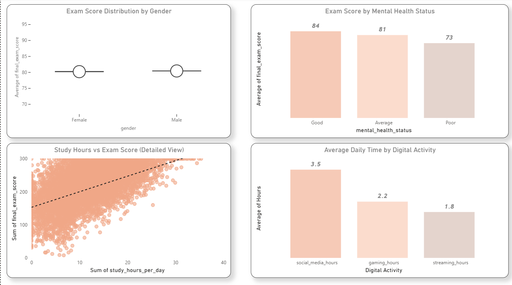

# 📊 Student Lifestyle & Academic Performance

This is my **first EDA (Exploratory Data Analysis) project**.  
I analyzed data of 15,000 students to find out what habits affect their exam scores.

> 🙋 I was stuck in tutorial hell for a long time. This is my first step out of it — a real project with real data.

---

## 🤔 What Questions I Tried to Answer

- Does studying more actually improve scores?
- Does using social media or gaming hurt performance?
- Does mental health affect grades?
- What do top-performing students have in common?

---

## 📁 About the Dataset

The dataset has **15,000 rows** and **18 columns**.  
Each row = one student. Each column = one detail about that student.

| Column | What it means |
|--------|---------------|
| `study_hours_per_day` | How many hours the student studies daily |
| `smartphone_usage_hours` | Daily phone usage |
| `social_media_hours` | Time spent on social media |
| `sleep_hours` | How many hours they sleep |
| `class_attendance_percent` | What % of classes they attended |
| `mental_health_status` | Good / Average / Poor |
| `final_exam_score` | Their exam score (this is what I'm analyzing) |

✅ No missing values — the data was already clean.

---

## 🛠️ Tools I Used

| Tool | Why I used it |
|------|---------------|
| Python | Main programming language |
| Pandas | To load and work with the data |
| Seaborn & Matplotlib | To make charts |
| Jupyter Notebook | To write code and notes together |
| Power BI | To make an interactive dashboard |

---

## 🔍 What I Did (Step by Step)

### 1. Loaded the data
```python
df = pd.read_csv("student_digital_life.csv")
df.head()  # shows first 5 rows
```
Just to make sure the file loaded and see what it looks like.

---

### 2. Checked for problems
```python
df.isnull().sum()     # missing values? → None ✅
df.duplicated().sum() # duplicate rows? → None ✅
```

---

### 3. Created a new column
```python
df["total_screen_time"] = (
    df["social_media_hours"] +
    df["gaming_hours"] +
    df["streaming_hours"]
)
```
I added all screen time together into one column called `total_screen_time`.  
This is called **feature engineering** — making a new, more useful column from existing ones.

---

### 4. Explored each column (Univariate Analysis)
I made charts for individual columns to understand the data better.

- Most students study **3–6 hours/day**
- Many students use their phone **5+ hours/day**
- Age is mostly between **18–23**

---

### 5. Compared columns to exam scores (Bivariate Analysis)
I made scatter plots to see if two things are related.

- More study hours → Higher exam scores ✅
- More attendance → Higher scores ✅
- More screen time → Slightly lower scores 📉

---

### 6. Looked at groups (Categorical Analysis)
Used box plots to compare exam scores across groups.

- **Mental health matters** — Good health = avg score 84, Poor = avg score 73
- **Gender doesn't matter much** — Male and Female scores are nearly the same

---

### 7. Correlation Heatmap
A heatmap shows which columns are related to each other.  
The stronger the color, the stronger the relationship.

**Most related to exam scores:**
- Study hours
- Class attendance
- Assignment completion

---

## 📊 Power BI Dashboard

I also built an **interactive dashboard** in Power BI with filters for gender, mental health, internet quality, and parent education.

### Dashboard Overview


### Dashboard Deep Dive


---

## 💡 What I Found

1. **Study hours are the #1 factor** — students who study more score higher
2. **Attendance really matters** — skipping class hurts your grade
3. **Mental health affects grades** — students with poor mental health score ~11 points lower on average
4. **Gender has no effect** on exam scores in this dataset
5. **Too much screen time** has a small negative effect on scores

---

## 😅 Honest Note

I spent way too long watching tutorials and not building anything.  
This project is me finally doing something real — it's not perfect, but it's mine.  
If you're also stuck in tutorial hell, just start. The learning happens when you build.

---

## 📬 Let's Connect

[](https://github.com/yourusername)
[](https://linkedin.com/in/yourusername)
